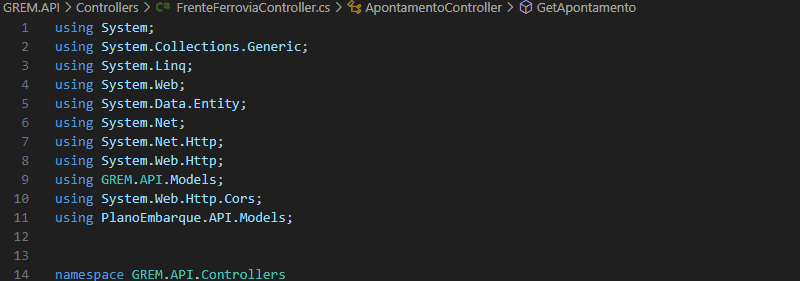

<!--  -->

<h1 align="center">👋 Olá! Eu sou Mauro de Amorim</h1>

Gerente de projetos de tecnologia da informação <strong>sênior</strong> · Líder de projetos · Analista de sistemas <strong>sênior</strong> · Desenvolvedor .Net <strong>Full Stack</strong> apaixonado por tecnologia, com foco em <strong>C#, .NET</strong> e <strong>Angular</strong>. Busco constantemente desafios que ampliem meus conhecimentos e me ajudem a evoluir como profissional.

  <a href="#sobre">Sobre</a> • 
  <a href="#tecnologias">Tecnologias</a> • 
  <!-- <a href="#projetos">Projetos</a> •  -->
  <a href="#artigos">Artigos</a> • 
  <a href="#contato">Contato</a>

<h2 id="sobre">💻 Sobre Mim</h2>

Está à procura de um Desenvolvedor Dot.Net criativo e experiente? Não procure mais, pois eu estou
pronto para desempenhar o cargo! Com mais de 28 anos de experiência como Desenvolvedor, estou pronto
para entrar e dar uma contribuição imediata para a continuação do sucesso da sua Empresa.
Está à procura de alguém que possa trabalhar com uma grande variedade de linguagens de programação
e que faça a gestão das entregas dos projetos? É exatamente para isso que eu estou preparado! Como
Desenvolvedor Dot.Net, trabalho diretamente com os clientes para desenvolver âmbitos e gerir as etapas
do projeto. Sou experiente em C#, VB.NET,ASP Clássico, Angular, Nodes e proficiente em muitas outras
linguagens de programação. Proficiência em migrações de sistemas. Adicionalmente, sou inovador, forte
a tomar decisões e tenho excelentes capacidades de comunicação.
Estou ansioso por me reunir consigo pessoalmente, ainda esta semana, e discutir os detalhes deste cargo.
Entretanto, por favor, veja o meu currículo abaixo. Referências estão disponíveis mediante solicitação.
Atenciosamente,
Mauro de Amorim

### 🌐 Redes Sociais

 

 

<!--  -->
<!--  -->

<h2 id="tecnologias">✅ Tecnologias que utilizo</h2>

### 🧠 Back-End

  
  
  
  

### 🎨 Front-End

  
  
  
  
  
  
  

### 🗄️ Banco de Dados

  
  
  

### ☁️ Infraestrutura e Virtualização

  
  
  

---

<!-- <h2 id="projetos">🚀 Projetos em destaque</h2>

### ✨ [ListiFy](https://www.listify.com.br)
Sistema para organização de itens (livros, CDs, revistas, etc.) com interface moderna e responsiva.

- 🧰 **Tecnologias**: .NET, SQL Server, Angular 16, TailwindCSS  
- 🔍 **Funcionalidades**: Busca em tempo real, carrossel de imagens, API RESTful -->

---

<h2 id="artigos">📝 Artigos publicados</h2>

- [Classes e Objetos em C#](https://dev.to/mauro_deamorim_2fc134fd3/classes-e-objetos-em-c-net-6ll)
<!-- - [Métodos Assíncronos](https://dev.to/felipeamorimdev/metodos-assincronos-uma-abordagem-no-desenvolvimento-de-software-3l0g) -->
<!-- - [O que é Lazy Loading](https://dev.to/felipeamorimdev/o-que-e-lazy-loading-g1i) -->

---

<!-- <h2>🖌️ Figma</h2>

Explore meus projetos de UI/UX no Figma:  
**[Acesse meu perfil no Figma](https://www.figma.com/@felipefamorim)** -->

<h2 id="contato">💬 Contato:</h2>

<h3>Obrigado por Visitar!</h3>

